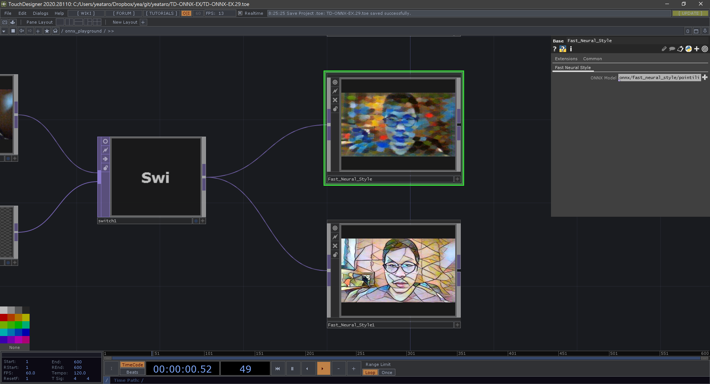

# TD-ONNX-EX
Examples of using [onnxruntime](https://github.com/microsoft/onnxruntime) in TouchDesigner.

---
## Models
- [Fast Neural Style Transfer](https://github.com/onnx/models/tree/master/vision/style_transfer/fast_neural_style)
- [waifu2x-onnx](https://github.com/tcyrus/waifu2x-onnx)
